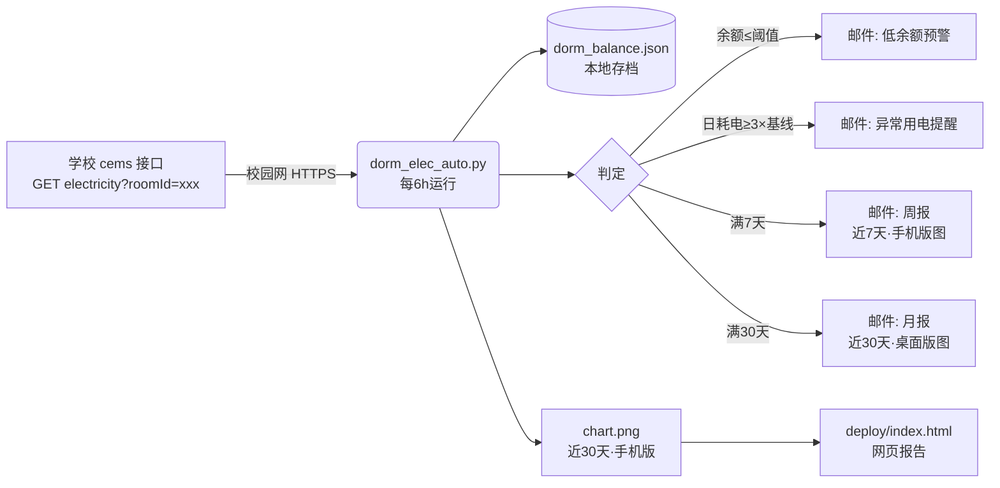

# 宿舍电费自动监控 · 西安交大创新港(A区)

> 一个面向西安交通大学创新港A区（B/C区和畅园的同学应该也可以）同学的**宿舍电费自动监控**小工具：定时抓取学校「cems」系统余额，自动反推用电量，余额过低 / 用电异常时邮件提醒，并定期推送用电趋势图报告。

---

## 一、项目简介

学校只提供「移动交通大学」APP 查看电费余额，没有开放接口、也不能直观看到用电趋势。
本项目通过抓包定位到后台接口，用一段轻量 Python 脚本实现：

- 🔄 **每 6 小时**自动读取宿舍电费余额（校园网环境下运行）
- 📉 自动**反推用电量**（近 24 小时 / 日均）
- 📧 **低余额预警**（低于阈值发邮件）
- ⚡ **异常用电检测**（用电量骤增时提醒，防忘关电器 / 故障 / 漏电）
- 🔐 **无需登录凭证**：接口在校园网内仅凭 `roomId` 即可取数，无需抓包 JWT、无需任何 Cookie
- 📊 **双周期报告**：每周发「近一周·手机版」趋势图，每月发「近 30 天·桌面版」趋势图
- 🌐 生成**网页报告**，本机浏览器打开看**实时刷新**的统计图

> 本仓库为通用模板，**核心配置（房间号）需自行填充**，详见下文「安装与配置」。

---

## 二、功能特性一览

| 功能 | 说明 |
|------|------|
| 余额采集 | 每 6h 调用 cems 接口，取回当前余额（元） |
| 用量反推 | 由相邻两次余额差计算用电量；区分「耗电」与「充值」 |
| 本地存档 | 数据落盘 `dorm_balance.json`，仅保留最近 `RETENTION_DAYS`（默认 100）天 |
| 低余额预警 | 余额 ≤ `THRESHOLD`（默认 ¥10）时立即邮件提醒 |
| 异常用电检测 | 积累 ≥`ANOMALY_MIN_SAMPLES`（默认 20）条后启用；最新一段「日耗电速率」≥ 基线（中位数）的 `ANOMALY_MULTIPLE`（默认 3）倍且单次 ≥`ANOMALY_MIN_USAGE`（默认 ¥5）则提醒（冷却 `ANOMALY_COOLDOWN_DAYS` 天） |
| 周报 | 每 `REPORT_CYCLE_DAYS`（默认 7）天，邮件推送「近一周·手机竖屏版」趋势图 |
| 月报 | 每 `MONTHLY_CYCLE_DAYS`（默认 30）天，邮件推送「近 30 天·桌面横版」趋势图 |
| 网页报告 | 生成自包含 `deploy/index.html`（引用趋势图），本机浏览器实时查看 |
| 推送渠道 | Python 内置 SMTP（QQ/163/Gmail 等邮箱均可，可打包进 exe 双击即用） |

---

## 三、技术架构



**数据反推原理**：相邻两次采样余额差即该时段用电量（余额下降=耗电，回升=充值）。异常检测把任意时长段的耗电**折算成「元/天」速率**再与历史基线比较，因此对采样间隔不均匀（偶尔漏跑）也鲁棒。

---

## 四、效果示意

下图为脚本生成的趋势图（示例数据，含充值（高度封顶）、异常、正常三种标记示例）：


- 上方：余额折线 + 极浅填充 + 预警线标签
- 下方：每日金额变化圆角柱（蓝=正常用电 / 红=异常 / 绿=充值）
  - **充值柱高度封顶**：充值金额常达百元级别，远大于日均用电（~1 元）。为避免充值柱把纵轴拉爆导致日用电不可见，充值柱按"日用电标尺"封顶绘制（默认 `RECHARGE_CAP_MULT=2.0` 倍），真实金额以 `▲+金额` 标注显示。图例中标记为「充值(高度封顶)」。
- 顶部 KPI 卡片：当前余额 / 区间总计用电 / 区间充值 / 日均用电

---

## 五、环境依赖

两种使用方式，按需二选一：

**方式 A：直接用 exe（推荐，零环境配置）**
- 从本仓库 **Releases 页面**下载 `宿舍电费监控_onefile.exe`（单文件）或 `宿舍电费监控_onedir.zip`（目录版），双击即用，**无需安装 Python / 任何依赖**。
- 首次启动会弹出图形配置向导，按提示填房间号、邮箱、SMTP 授权码即可（见下文「六、安装、配置与运行」）。
- 运行环境：**需能访问校园网**（cems 为校内系统，公网不可达）。

**方式 B：源码运行（适合开发者/想自己打包）**
- Python ≥ 3.8
- Python 库：`requests`、`matplotlib`、`numpy`；打包另需 `pyinstaller`
- 运行环境：**需能访问校园网**
- 邮件用 Python 内置 `smtplib` 直连邮箱 SMTP 服务器（QQ/163/Gmail 等均可），**无需 Node.js / agently-cli**。

> 推荐用虚拟环境：`python -m venv .venv` → `.venv\Scripts\activate` → `pip install -r requirements.txt`。

---

## 六、安装、配置与运行

> 💡 **懒人最省事**：直接从本仓库 **Releases 页面**下载打包好的 **exe**，全程图形界面，不用碰命令行、不用装 Python。
> 想从源码自己打包，见文末「附录：自己打包成 exe」。

### 第 0 步：抓包获取配置参数

[抓包指南](抓包指南.md)
获得参数：**roomId**（接口仅需在校园网内 + roomId 即可取数，**无需 JWT / 登录凭证**）

### 方式 A：exe 双击即用（推荐）

#### 1) 从 Releases 下载（两个版本，功能完全一致，任选其一）

| | `宿舍电费监控_onefile.exe`（单文件版） | `宿舍电费监控_onedir.zip`（目录版） |
|---|---|---|
| 形态 | 单个 exe 文件，拷到任意位置双击即用 | 压缩包，解压后是一整个文件夹（exe + `_internal` 依赖） |
| 启动速度 | 首启稍慢（需解压运行环境） | 启动快 |
| 内存占用 | 略高 | 略低 |
| 拷贝/分发 | 只带一个文件即可 | 整个文件夹一起拷贝，不能只拿 exe |
| 适合场景 | 想只带一个文件、随处拷贝 | 固定放在某处长期运行 |

> 共同点：功能完全相同；首次启动都会弹出图形配置向导；`.env`/存档/日志等数据都落在 **exe 同目录**（便携可迁移）。**两个版本不要放在同一目录同时运行**（数据与锁文件会互相干扰）。

#### 2) 首次启动：配置向导

1. 拿到 exe（单文件版）或解压 onedir 压缩包，放到任意位置。
2. **双击 exe** → 首次启动自动弹出图形配置向导，按提示填：
   - 宿舍房间号 roomId
   - 收件邮箱（接收电费通知的邮箱）
   - 发件邮箱服务商（下拉选 QQ/163/Gmail/Outlook，自动填好 SMTP 服务器）
   - 发件邮箱账号 + **SMTP 授权码**（⚠️ 不是登录密码，见下方说明）
3. 点 **「测试连接」** → 稍等收到测试邮件即说明配置成功 → 点 **「保存并开始」**。
4. 向导关闭后程序自动进入常驻：每 6h 抓取、低余额预警、周/月报、本地网页服务（本机浏览器打开 `http://127.0.0.1:8765/` 看实时报告）。
5. 下次双击直接常驻（配置已存 `.env`，不再弹向导）。

> ⚠️ **SMTP 授权码怎么获取？**
> 授权码 ≠ 邮箱登录密码，需到邮箱网页开启「SMTP 服务」后生成：
> - **QQ 邮箱**：设置 → 账户 → 开启「IMAP/SMTP 服务」→ 生成授权码
> - **163 邮箱**：设置 → POP3/SMTP/IMAP → 开启「SMTP 服务」→ 设置授权码
> - **Gmail**：账户开启「两步验证」后生成「应用专用密码」
> 向导里选对应服务商，主机/端口/加密方式会自动填好，你只需填账号和授权码。

### 方式 B：源码运行 / 自己打包

```bash
git clone <你的仓库地址>
cd dorm-electricity-monitor
python -m venv .venv
.venv\Scripts\activate            # Windows 进入虚拟环境
pip install -r requirements.txt
```

填好配置（任选其一）：
- **图形向导**：`python config_wizard.py`（与 exe 首次启动同一个界面）
- **命令行**：`python setup.py`
- **手动编辑**：`cp .env.example .env` 后用记事本填字段

```bash
python config_wizard.py     # 推荐：图形界面，带「测试连接」
```

<details>
<summary>备选：手动配置 .env 字段</summary>

```bash
cp .env.example .env
# 用记事本打开 .env，填下面字段：
```

```ini
# 本地配置，已被 .gitignore 排除，严禁提交
XJTU_ROOM_ID=××××                        # 必填：房间号（ProxyPin 抓包请求 URL 里的 roomId 参数）
XJTU_RECIPIENT=you@example.com            # 必填：收件邮箱
# SMTP 发件配置（必填，用于发邮件）
SMTP_HOST=smtp.qq.com                     # 发件服务器（QQ=smtp.qq.com / 163=smtp.163.com）
SMTP_PORT=465                             # 端口（SSL 通常 465，STARTTLS 587）
SMTP_TLS=ssl                              # 加密方式：ssl / starttls / none
SMTP_USER=you@example.com                 # 发件邮箱账号
SMTP_PASS=<你的SMTP授权码>                # 授权码（不是登录密码！）
SMTP_FROM=                               # 可选：留空则用 SMTP_USER
```

</details>

### 收件邮箱填谁的？（重要）

- **发件人 = `SMTP_USER`**：你开启 SMTP 服务的那个邮箱（如你的 QQ 邮箱）。
- **收件人 = `XJTU_RECIPIENT`**：填你平时看邮件的邮箱（可与发件人相同自收发，或填常用邮箱）。不填脚本会直接报错退出。

> ⚠️ **本配置不含任何登录凭证**：接口在校园网内仅凭 `roomId` 即可取数，无需 JWT / Cookie。请照常**不要把 `.env` 提交到公开仓库**（虽无凭证，但含你的房间号与邮箱）。`.env` 放在脚本同目录即可，**无需设置系统环境变量**。

### 全部可自定义配置项一览

**A. `.env` 字段（每台机器不同，必须改）**

| 变量 | 是否必须 | 含义 |
|------|---------|------|
| `XJTU_ROOM_ID` | ✅ 必填 | 宿舍房间号（roomId，校园网内取数唯一所需参数） |
| `XJTU_RECIPIENT` | ✅ 必填 | 收件邮箱，接收所有通知与报告 |
| `SMTP_HOST` | ✅ 必填 | 发件 SMTP 服务器（如 `smtp.qq.com`） |
| `SMTP_PORT` | ✅ 必填 | 端口（SSL 通常 465，STARTTLS 587） |
| `SMTP_TLS` | ✅ 必填 | 加密方式：`ssl` / `starttls` / `none` |
| `SMTP_USER` | ✅ 必填 | 发件邮箱账号 |
| `SMTP_PASS` | ✅ 必填 | SMTP 授权码（非登录密码） |
| `SMTP_FROM` | 可选 | 发件人地址；留空则用 `SMTP_USER` |

> 配置优先级：**`.env` > 系统环境变量 > 代码内置默认值**。改 `.env` 立即生效，无需动系统环境变量。

**B. 脚本顶部常量（通用参数，按需改）**

| 常量 | 默认值 | 含义 |
|------|--------|------|
| `THRESHOLD` | `10.0` | 低余额预警线（元） |
| `RETENTION_DAYS` | `100` | 历史存档保留天数 |
| `REPORT_CYCLE_DAYS` | `7` | 周报周期（天） |
| `MONTHLY_CYCLE_DAYS` | `30` | 月报周期（天） |
| `PRICE_PER_KWH` | `0.0` | 电价（元/度），填了会把金额折算成「度」 |
| `ANOMALY_MIN_SAMPLES` | `20` | 启用异常检测所需最少记录数 |
| `ANOMALY_MULTIPLE` | `3.0` | 触发异常的倍数阈值 |
| `ANOMALY_MIN_USAGE` | `5.0` | 单次消耗低于此值不报异常（元） |
| `ANOMALY_COOLDOWN_DAYS` | `1` | 异常邮件最短间隔（天） |
| `RECHARGE_CAP_MULT` | `2.0` | 充值柱高度封顶倍数（相对日用电最大值）；调大=充值柱更高，调小=更紧凑 |

### 启动 / 停止 / 调试

> **一个进程搞定全部**：`dorm_elec_auto.py` **自带网页服务**——一边按 `XJTU_INTERVAL_HOURS`（默认 6 小时，可用环境变量覆盖）循环抓取电费，一边在后台起一个本地网页服务（端口 `8765`）把 `deploy/` 实时提供出来。**抓取与网页是同一个进程，停止/启动一体。**

- **启动**：
  - **exe 模式**：直接双击 `宿舍电费监控.exe`（配置已存则直接常驻；首次启动会弹配置向导）；
  - **源码模式**：双击 **`run_dorm.vbs`**（静默拉起 `pythonw`，不弹窗）；或
  - 命令行 `.venv\Scripts\pythonw.exe dorm_elec_auto.py`。
- **停止**（二选一）：
  - 双击 **`stop_dorm.bat`**（结束 `pythonw.exe` 与 `宿舍电费监控.exe` 并清锁，最稳妥；会短暂弹一个命令行窗口，运行完显示「完成」即可关闭）；
  - 任务管理器里结束 `pythonw.exe` / `宿舍电费监控.exe` 进程。
  - 两种方式都会清掉锁文件；即便锁残留，**停掉后随时可再启动、不会被旧锁卡住**——进程被杀后锁里的 PID 已失效，新实例检测到「死 PID」会立即接管。
- **调试单次**：双击 `run_dorm.bat`（前台窗口、`--once` 跑一次即退出，看得见日志，不常驻、不起网页服务）。

### 本机浏览器看实时报告

服务常驻后，本机浏览器打开 `http://127.0.0.1:8765/` 即看（默认仅本机可访问）。
访问地址也会写在 `deploy/serve_url.txt`。
页面自带 `<meta http-equiv="refresh" content="60">` 且服务器返回 `Cache-Control: no-store`——**每 60 秒自动刷新到最新图，浏览器不缓存旧图**。

> ⚠️ **访问范围**：网页服务默认只绑定本机（`127.0.0.1`），**不对外暴露**，校园网内其它设备无法访问。

> 📌 **抓取频率**：默认每 6 小时一轮（启动时先抓一次）。周报/月报按「数据积累天数」触发，与抓取频率无关；
> 「抓取连续失败 24 小时才告警」。可用环境变量 `XJTU_INTERVAL_HOURS` 覆盖间隔（例如设 `2` 表示每 2 小时）。

> `.env` 与脚本同目录即可（脚本会自动读取），**无需设置系统环境变量**。

---

## 七、文件结构

本项目已整理在 `dorm-electricity-monitor/` 文件夹中，克隆仓库后该目录即项目根。

```
dorm-electricity-monitor/          # 项目根目录（git 仓库根）
├── dorm_elec_auto.py        # 核心脚本（单进程服务）：采集+计算+绘图+邮件(SMTP)推送+报告生成+内置实时网页服务
├── config_wizard.py         # 首次配置图形向导（tkinter）：exe 双击首启时弹出；也可 python config_wizard.py 重配
├── build_exe.py             # 打包脚本：python build_exe.py 一键生成 exe（默认 onedir）
├── setup.py                 # 命令行配置工具 → 生成 .env（重跑保留已有值）
├── test_core.py            # 单元测试（用量计算/异常检测）
├── run_dorm.bat             # 前台调试用：--once 跑一次即退出（看得见日志，不常驻）
├── run_dorm.vbs             # 静默启动器（pythonw，不弹窗）：双击/手动启动后台常驻
├── stop_dorm.bat            # 停止器（同时结束 pythonw.exe 与 宿舍电费监控.exe 并清锁）
├── .env.example             # 配置模板（复制为 .env 后填写；含 SMTP 字段）
├── .gitignore
├── LICENSE                  # MIT 许可证
├── README.md
├── 抓包指南.md            # 抓包获取 roomId 图文教程（无需 JWT）
├── assets/
│   └── preview.png          # README 效果示意图
├── deploy/                 # 【运行生成，gitignore】网页报告目录
│   ├── index.html           # 实时网页（外部 chart.png + 每60秒自动刷新）
│   ├── chart.png            # 趋势图（脚本生成，内置网页服务实时读取）
│   └── serve_url.txt        # 内置服务写出的本机访问地址
├── .env                     # 【本地生成，gitignore】真实配置（含 SMTP 授权码），切勿提交
├── .venv/                   # 【本地生成，gitignore】Python 虚拟环境
├── dorm_balance.json        # 【本地生成，gitignore】历史存档
├── build/, dist/            # 【打包生成，gitignore】PyInstaller 构建产物
└── __pycache__/             # 【本地生成，gitignore】Python 缓存
```

> 标注 **【gitignore】** 的文件由 `.gitignore` 排除，不会进入版本库；其余文件均已提交。

> **网页报告**：`deploy/index.html` 是由 `dorm_elec_auto.py` 每次运行生成的**自动监控报告**（引用 `chart.png` + 每 60 秒自动刷新），由脚本**内置网页服务**常驻提供，本机浏览器打开即看最新图。它是脚本产物，无需手动维护。

---

## 八、技术路线图（Roadmap）

### ✅ 已完成（v2.0）
- [x] 抓包定位 cems 余额接口（ProxyPin，webview 明文）
- [x] 每 6h 自动采集 + 本地存档（保留 100 天）
- [x] 用电量反推（近 24h / 日均，区分充值与耗电）
- [x] 低余额邮件预警
- [x] 异常用电检测（日速率 ≥ 3× 基线）
- [x] 双周期报告：周报（近 7 天·手机版）+ 月报（近 30 天·桌面版）
- [x] 专业级可视化（KPI 卡片 / 圆角柱 / 统一冷色调 / 底部图例 / 移动端适配）
- [x] 充值柱高度封顶（避免充值金额拉爆纵轴，真实金额以标注显示）
- [x] 网页报告（内置实时网页服务，本机浏览器查看）
- [x] SMTP 邮件推送（QQ/163/Gmail 等，可打包进 exe）
- [x] 免登录凭证取数（校园网内仅凭 roomId 即可，无需抓包 JWT）
- [x] 凭证安全外置（环境变量 / `.env`，去除硬编码；本项目本就无需凭证）
- [x] 抓取重试 + 指数退避（瞬时失败不误发告警邮件，仅持续失败才提醒）
- [x] 运行日志 `dorm_monitor.log`（按大小滚动，排障用）
- [x] 调试参数 `--dry-run` / `--test-email`（验证配置与邮件通道）
- [x] 启动配置校验（房间号 / SMTP 关键字段 fail-fast）
- [x] 图形配置向导（tkinter，exe 首次启动自动弹出，带「测试连接」）
- [x] 一键打包 exe（onefile / onedir 两种模式）并随 GitHub Releases 发布


因为是小白，对代码的理解仅限于本科学过的大计基和C++以及计算机二级hh
肯定存在可以优化的地方
欢迎大佬一起完善 👏

---

## 九、调试与排障

本工具默认后台常驻运行（exe 双击或 `pythonw` 静默运行，无可见控制台），以下手段便于验证配置与排查问题：

```bash

# ⚠️ 必须用本项目 .venv 运行（不要用 anaconda 等其它 Python：
#    其它环境的 matplotlib 在生成图表时可能原生崩溃 segfault）。
.venv\Scripts\python.exe dorm_elec_auto.py --dry-run      # 0) 校验配置+预览将做什么
.venv\Scripts\python.exe dorm_elec_auto.py --test-email   # 1) 发测试邮件，确认通道正常
.venv\Scripts\python.exe dorm_elec_auto.py                # 2) 正常运行一次
```

- **运行日志**：每次运行写入 `dorm_monitor.log`（按大小滚动，保留最近 3 份），含时间戳、步骤与错误原因，排障时优先查看。
- **瞬时失败不误报**：网络抖动等瞬时错误会自动重试（3 次，指数退避），且**不会**发告警邮件；仅当抓取连续失败超过 24 小时才会发「持续异常」邮件，避免误报。
- **启动即校验**：房间号须为正整数、收件邮箱与 SMTP 关键字段须齐全，配置错误会立即给出清晰报错退出。首次启动无 `.env` 时会自动弹出图形配置向导。
- **单元测试**：核心纯函数（用量计算 / 异常检测）有 `test_core.py` 覆盖，改代码前可先跑一遍防回归：
  ```bash
  .venv\Scripts\python.exe test_core.py
  ```

---

## 十、安全与隐私

- 本项目**无需任何登录凭证**：cems 接口在校园网内仅凭 `roomId` 即可取数，代码与配置中均不含 JWT / 账号密码等敏感信息。
- 尽管如此，仍建议**不要把 `.env` 提交到任何公开仓库**（其中含你的房间号与收件邮箱）。本项目已通过「`.env`（gitignore 排除）」方式管理配置。
- 数据仅保存在你本地 `dorm_balance.json`，不上传任何第三方服务器（除你主动配置的邮件收件人与部署平台）。
- 请遵守学校网络使用规范，勿高频请求接口（默认 6h 一次，已足够温和）。

---

## 附录：自己打包成 exe

仓库自带一键打包脚本 `build_exe.py`，把项目打包成 Windows exe（双击即用，无需 Python 环境）。

```bash
# 1) 装好构建依赖（含 PyInstaller）
pip install -r requirements.txt

# 2) 一键打包（默认 onedir 模式：启动快、对 matplotlib 友好）
python build_exe.py

# 备选：单文件 exe（首启稍慢，体积更大）
python build_exe.py --onefile
```

产物位置：
- onedir：`dist/宿舍电费监控/宿舍电费监控.exe`（**连同整个文件夹一起分发**）
- onefile：`dist/宿舍电费监控.exe`

> GitHub Releases 上发布的两个资产即上述两种产物：`宿舍电费监控_onefile.exe`（单文件版）与 `宿舍电费监控_onedir.zip`（目录版压缩包），对应关系见「六、安装、配置与运行 → 方式 A」。

打包关键点（脚本已自动处理）：
- `--windowed`：无控制台黑窗，后台常驻；首次启动弹 tkinter 配置向导。
- `--collect-all matplotlib`：matplotlib 字体/样式数据必须显式收集，否则绘图崩溃。
- 数据文件（`.env`/存档/日志/`deploy/`）运行时落在 **exe 同目录**，便携可迁移。

> ⚠️ **杀软误报**：PyInstaller 打包的 exe 有时会被杀毒软件误报，属常见现象（因自打包 exe 特征）。可加入信任名单，或用 onedir 模式（误报率更低）。

---

## 十一、免责声明

本项目仅供学习与个人用电管理之用。接口与字段为抓包逆向所得，学校可能随时调整；
使用本工具产生的任何后果由使用者自行承担，与学校及本仓库作者无关。
请合理使用，不要对校园系统造成额外负担。

---

## 十二、许可证

[MIT](LICENSE) — 自由使用、修改、分发，但需保留版权声明。
