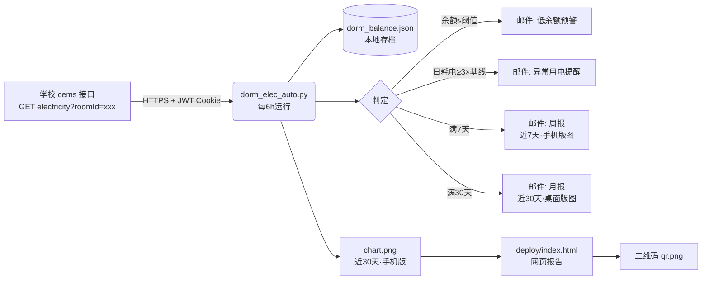
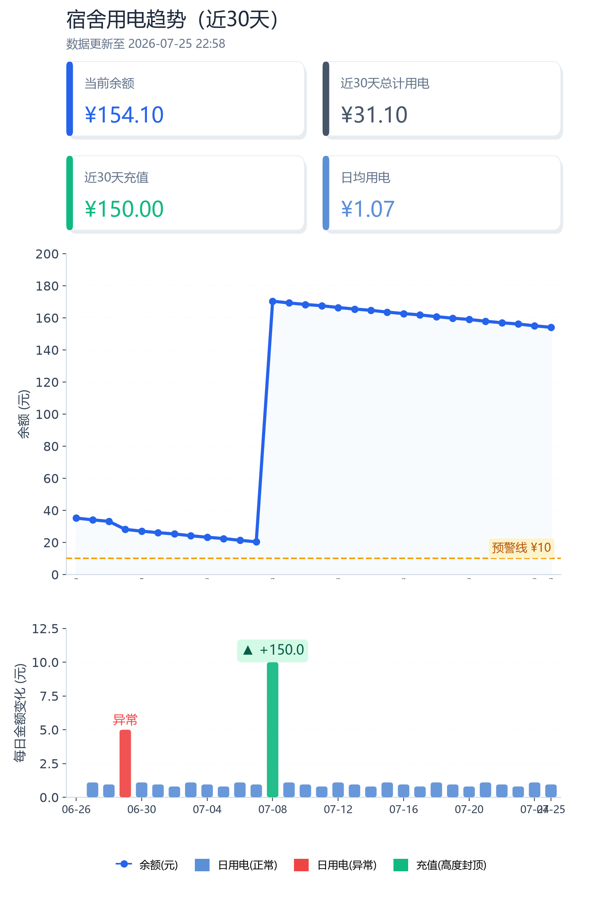

# 宿舍电费自动监控 · 西安交大创新港

> 一个面向西安交通大学创新港同学的**宿舍电费自动监控**小工具：定时抓取学校「cems」系统余额，自动反推用电量，余额过低 / 用电异常时邮件提醒，并定期推送美观的趋势图报告。

---

## 一、项目简介

学校只提供「移动交通大学」APP 查看电费余额，没有开放接口、也不能直观看到用电趋势。
本项目通过抓包定位到后台接口，用一段轻量 Python 脚本实现：

- 🔄 **每 6 小时**自动读取宿舍电费余额（校园网环境下运行）
- 📉 自动**反推用电量**（近 24 小时 / 日均）
- 📧 **低余额预警**（低于阈值发邮件）
- ⚡ **异常用电检测**（用电量骤增时提醒，防忘关电器 / 故障 / 漏电）
- 📊 **双周期报告**：每周发「近一周·手机版」趋势图，每月发「近 30 天·桌面版」趋势图
- 🌐 生成**网页报告 + 二维码**，手机扫码随时看

> 本仓库为通用模板，**核心配置（房间号、登录凭证）需自行填充**，详见下文「安装与配置」。

---

## 二、功能特性一览

| 功能 | 说明 |
|------|------|
| 余额采集 | 每 6h 调用 cems 接口，取回当前余额（元） |
| 用量反推 | 由相邻两次余额差计算用电量；区分「耗电」与「充值」 |
| 本地存档 | 数据落盘 `dorm_balance.json`，仅保留最近 `RETENTION_DAYS`（默认 100）天 |
| 低余额预警 | 余额 ≤ `THRESHOLD`（默认 ¥10）时立即邮件提醒 |
| 异常用电检测 | 积累 ≥`ANOMALY_MIN_SAMPLES`（默认 20）条后启用；最新一段「日耗电速率」≥ 基线（中位数）的 `ANOMALY_MULTIPLE`（默认 3）倍且单次 ≥`ANOMALY_MIN_USAGE`（默认 ¥5）则提醒（冷却 `ANOMALY_COOLDOWN_DAYS` 天） |
| 周报 | 每 `REPORT_CYCLE_DAYS`（默认 7）天，邮件推送「近一周·手机竖屏版」趋势图 |
| 月报 | 每 `MONTHLY_CYCLE_DAYS`（默认 30）天，邮件推送「近 30 天·桌面横版」趋势图 |
| 网页报告 | 生成自包含 `deploy/index.html`（内嵌趋势图 + 二维码），可部署到公网 |
| 推送渠道 | [Agent Mail CLI](https://agent.qq.com)（以智能体邮箱身份发信，免费） |

---

## 三、技术架构



**数据反推原理**：相邻两次采样余额差即该时段用电量（余额下降=耗电，回升=充值）。异常检测把任意时长段的耗电**折算成「元/天」速率**再与历史基线比较，因此对采样间隔不均匀（偶尔漏跑）也鲁棒。

---

## 四、效果示意

下图为脚本生成的趋势图（示例数据，含充值（高度封顶）、异常、正常三种标记示例）：



- 上方：余额折线 + 极浅填充 + 预警线标签
- 下方：每日金额变化圆角柱（蓝=正常用电 / 红=异常 / 绿=充值）
  - **充值柱高度封顶**：充值金额常达百元级别，远大于日均用电（~1 元）。为避免充值柱把纵轴拉爆导致日用电不可见，充值柱按"日用电标尺"封顶绘制（默认 `RECHARGE_CAP_MULT=2.0` 倍），真实金额以 `▲+金额` 标注显示。图例中标记为「充值(高度封顶)」。
- 顶部 KPI 卡片：当前余额 / 区间总计用电 / 区间充值 / 日均用电

---

## 五、环境依赖

- Python ≥ 3.8
- Python 库：`requests`、`matplotlib`、`qrcode[pil]`
- 命令行工具：[`agently-cli`](https://agent.qq.com)（Agent Mail CLI，用于发邮件，需先 `agently-cli auth login` 完成 OAuth 授权）
- 运行环境：**需能访问校园网**（cems 为校内系统，公网不可达）

> 推荐用虚拟环境：`python -m venv .venv` → `.venv\Scripts\activate` → `pip install requests matplotlib "qrcode[pil]"`。

---

## 六、安装与配置（小白版，3 步搞定）

### 第 1 步：装好运行环境

```bash
git clone <你的仓库地址>
cd dorm-electricity-monitor
python -m venv .venv
.venv\Scripts\activate            # Windows 进入虚拟环境
pip install requests matplotlib "qrcode[pil]"
```

- 需要 **Python ≥ 3.8**（电脑已装可跳过前两步）。
- 邮件功能需要 **Node.js**（下一步会用到，没装的话去 nodejs.org 下个「LTS」版一路下一步即可）。

### 第 2 步：配置 Agent Mail（这就是发邮件的通道）

> 💡 **Agent Mail 是什么？**
> 腾讯推出的邮件发送工具，官网：<https://agent.qq.com/>
> **小白最省事的办法**：打开任意 Agent（比如 WorkBuddy 对话框），直接发这一句话👇
>
> ```
> 请阅读 https://agent.qq.com/doc/cli-setup.md 文档，按照步骤为我安装并配置 Agent Mail CLI。
> ```
>
> 它会自动帮你装好 `agently-cli` 并完成授权登录，**你完全不用自己记命令**。
>
> 想自己手动装也行：装好 Node.js 后执行 `npm i -g agently-cli`，再跑 `agently-cli auth login` 按提示用浏览器扫码授权。

### 第 3 步：填好配置（一键完成）

```bash
python setup.py
```

按提示回答几个问题（JWT、房间号、收件邮箱等），脚本自动生成 `.env`，**不用手动改任何文件**。

<details>
<summary>备选：手动配置（不想跑脚本时用）</summary>

```bash
cp .env.example .env
# 用记事本打开 .env，填下面 5 个字段：
```

```ini
# 本地配置（含凭证），已被 .gitignore 排除，严禁提交
XJTU_CEMS_JWT=eyJhbGci...你的完整JWT    # 必填：抓包得到的 Cookie
XJTU_ROOM_ID=2899                        # 你的房间号
XJTU_RECIPIENT=you@example.com            # 必填：收件邮箱
XJTU_SHARE_URL=                          # 可选：网页报告公网链接
AGENTLY_BIN=D:\path\to\agently-cli.cmd   # 可选：留空自动探测
```

</details>

### 收件邮箱填谁的？（重要）

- **发件人 = 你自己的「智能体邮箱」**：第 2 步 `agently-cli auth login` 授权后自动确定（形如 `xxx@agent.qq.com`），**不是**本仓库作者的地址。
- **收件人 = `XJTU_RECIPIENT`**：填你平时看邮件的邮箱（可以是同一个智能体邮箱自收发，也可以是常用 QQ/163 邮箱）。不填脚本会直接报错退出。

> ⚠️ **绝不要把真实 JWT 写进代码或提交到 Git**（JWT 内含学号、姓名）。本项目已从代码中移除硬编码凭证，统一由 `.env` 读取，`.env` 放在脚本同目录即可，**无需设置系统环境变量**。

### 全部可自定义配置项一览

**A. `.env` 字段（每台机器不同，必须改）**

| 变量 | 是否必须 | 含义 |
|------|---------|------|
| `XJTU_CEMS_JWT` | ✅ 必填 | 抓包得到的登录 JWT（含学号姓名，勿提交） |
| `XJTU_ROOM_ID` | 可选（默认 2899） | 宿舍房间号（roomId） |
| `XJTU_RECIPIENT` | ✅ 必填 | 收件邮箱，接收所有通知与报告 |
| `XJTU_SHARE_URL` | 可选 | 网页报告公网链接；填了二维码才有效 |
| `AGENTLY_BIN` | 可选（自动探测） | `agently-cli` 绝对路径；探测失败时需手填 |

> 配置优先级：**`.env` > 系统环境变量 > 代码内置默认值**。改 `.env` 立即生效，无需动系统环境变量。

**B. 脚本顶部常量（通用参数，按需改）**

| 常量 | 默认值 | 含义 |
|------|--------|------|
| `THRESHOLD` | `10.0` | 低余额预警线（元） |
| `RETENTION_DAYS` | `100` | 历史存档保留天数 |
| `REPORT_CYCLE_DAYS` | `7` | 周报周期（天） |
| `MONTHLY_CYCLE_DAYS` | `30` | 月报周期（天） |
| `PRICE_PER_KWH` | `0.0` | 电价（元/度），填了会把金额折算成「度」 |
| `ANOMALY_MIN_SAMPLES` | `20` | 启用异常检测所需最少记录数 |
| `ANOMALY_MULTIPLE` | `3.0` | 触发异常的倍数阈值 |
| `ANOMALY_MIN_USAGE` | `5.0` | 单次消耗低于此值不报异常（元） |
| `ANOMALY_COOLDOWN_DAYS` | `1` | 异常邮件最短间隔（天） |
| `RECHARGE_CAP_MULT` | `2.0` | 充值柱高度封顶倍数（相对日用电最大值）；调大=充值柱更高，调小=更紧凑 |

---

## 七、部署运行

### Windows（推荐）
用「任务计划程序」每 6 小时跑一次（无需 WorkBuddy / 任何 IDE，独立运行）：
```powershell
$action = New-ScheduledTaskAction -Execute "<项目路径>\.venv\Scripts\python.exe" -Argument "dorm_elec_auto.py" -WorkingDirectory "<项目路径>"
$trigger = New-ScheduledTaskTrigger -Once -At (Get-Date) -RepetitionInterval (New-TimeSpan -Hours 6) -RepetitionDuration (New-TimeSpan -Days 3650)
Register-ScheduledTask -TaskName "宿舍电费监控" -Action $action -Trigger $trigger -Force
```
> `.env` 与脚本同目录即可（脚本会自动读取），**无需设置系统环境变量**。

### 可选：公网网页报告
将 `deploy/` 目录部署到任意静态托管（如 CloudStudio / GitHub Pages / Vercel），把链接填入 `SHARE_URL` 并重新生成，即可扫码访问。

---

## 八、文件结构

```
dorm-electricity-monitor/
├── dorm_elec_auto.py        # 核心脚本（采集+计算+检测+绘图+推送+报告）
├── dorm-electricity-tracker.html  # 手动版单文件网页工具（记录+图表+预警，本地存储）
├── setup.py                 # 一键交互式配置（生成 .env）
├── run_dorm.bat             # Windows 定时任务启动器（自动定位到脚本目录）
├── dorm_balance.json        # 历史存档（本地，gitignore）
├── chart.png / qr.png       # 生成的趋势图 / 二维码（本地，gitignore）
├── deploy/
│   └── index.html           # 自包含网页报告（内嵌图+二维码）
├── .env.example             # 配置模板（复制为 .env 后填写）
├── .gitignore
├── LICENSE                  # MIT 许可证
├── assets/
│   └── preview.png          # README 效果示意图
└── README.md
```

---

## 九、技术路线图（Roadmap）

### ✅ 已完成（v1.0）
- [x] 抓包定位 cems 余额接口（ProxyPin，webview 明文）
- [x] 每 6h 自动采集 + 本地存档（保留 100 天）
- [x] 用电量反推（近 24h / 日均，区分充值与耗电）
- [x] 低余额邮件预警
- [x] 异常用电检测（日速率 ≥ 3× 基线）
- [x] 双周期报告：周报（近 7 天·手机版）+ 月报（近 30 天·桌面版）
- [x] 专业级可视化（KPI 卡片 / 圆角柱 / 统一冷色调 / 底部图例 / 移动端适配）
- [x] 充值柱高度封顶（避免充值金额拉爆纵轴，真实金额以标注显示）
- [x] 网页报告 + 二维码（CloudStudio 部署）
- [x] Agent Mail 免费推送渠道
- [x] 凭证安全外置（环境变量 / `.env`，去除硬编码）

### 🔧 计划中的改进（v1.1+）
- [ ] **JWT 自动刷新 / 登录态持久化**：当前 JWT 含过期时间，过期需重新抓包；拟加入自动续期或引导重新授权
- [ ] **跨平台定时**：补充 Linux `cron` / macOS `launchd` 配置示例（目前仅 Windows 任务计划）
- [ ] **Docker 化**：提供 `Dockerfile` + `docker-compose`，一键部署到 NAS / 云服务器
- [ ] **多房间 / 多账户**：`roomId` 参数化，支持同时监控多个宿舍
- [ ] **交互式仪表盘**：用 Plotly / ECharts 替代静态 PNG，网页可悬浮查看明细
- [ ] **异常检测增强**：按自然日聚合基线、引入季节性 / 周节律，降低误报
- [ ] **多渠道通知**：企业微信 / Server 酱 / Telegram 等免费通道
- [ ] **单元测试 + CI**：GitHub Actions 跑 `pytest`，保证重构不破坏逻辑
- [ ] **i18n**：补充英文 README 与界面文案
- [ ] **移动端 PWA / 轻量小程序**探索（仅查看，不含后台定时）

欢迎 Issue / PR 一起完善 👏

---

## 十、安全与隐私

- 本项目涉及你的校园网登录 JWT（含学号、姓名等个人信息）。**请勿将真实 JWT 提交到任何公开仓库**。
- 本项目已通过「环境变量 / `.env`（gitignore 排除）」方式管理凭证，代码中不再包含任何真实凭证。
- 数据仅保存在你本地 `dorm_balance.json`，不上传任何第三方服务器（除你主动配置的邮件收件人与部署平台）。
- 请遵守学校网络使用规范，勿高频请求接口（默认 6h 一次，已足够温和）。

---

## 十一、免责声明

本项目仅供学习与个人用电管理之用。接口与字段为抓包逆向所得，学校可能随时调整；
使用本工具产生的任何后果由使用者自行承担，与学校及本仓库作者无关。
请合理使用，不要对校园系统造成额外负担。

---

## 十二、许可证

[MIT](LICENSE) — 自由使用、修改、分发，但需保留版权声明。
