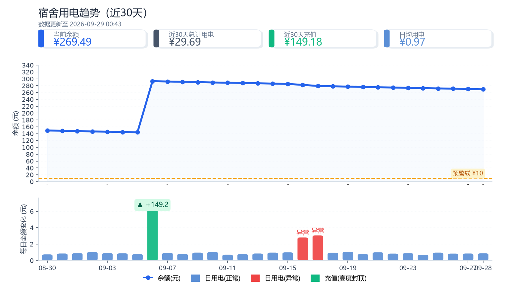
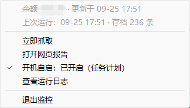
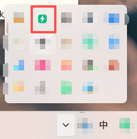
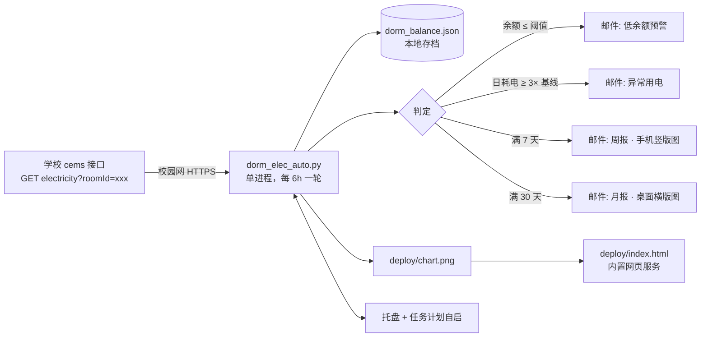

# 宿舍电费自动监控

> 西安交大宿舍电费自动监控：定时抓取学校「cems」系统余额，反推用电量，余额过低 / 用电异常时邮件提醒，并定期推送用电趋势图。
>
> **Windows 专用**，下载即用，无需安装 Python。**需处于校园网环境**（cems 是校内系统，公网不可达）。



---

## 一、快速开始

**第 1 步 · 下载**
到 [Releases 页面](https://github.com/smart-wcm/dorm-electricity-monitor/releases) 下载，二选一：

| | `onefile.exe` | `onedir.zip` |
|---|---|---|
| 形态 | 单个 exe，拷到哪都能双击 | 解压后是一整个文件夹 |
| 启动 | 首启稍慢（要解压运行环境） | 快 |
| 分发 | 只带一个文件 | 整个文件夹一起拷，**不能只拿 exe** |

> 功能完全相同。**不要把两个版本放在同一目录**（数据文件和锁文件会互相干扰）。

**第 2 步 · 双击 exe，填配置**

首次启动会弹出配置向导，按提示填 4 项：

- **房间号 roomId** — 怎么拿见 [抓包指南](抓包指南.md)
- **收件邮箱** — 接收预警和报告的邮箱
- **发件邮箱服务商** — 下拉选 QQ / 163 / Gmail / Outlook，主机和端口自动填好
- **发件账号 + SMTP 授权码** — ⚠️ 授权码**不是邮箱登录密码**

点「测试连接」，收到测试邮件就说明通了，再点「保存并开始」。

**第 3 步 · 完事**

程序转入后台常驻：每 6 小时抓一次电费，低余额 / 异常用电时发邮件，每周、每月各推一份趋势图。右下角托盘图标显示运行状态。

---

## 二、日常使用

程序所有操作都在**右下角托盘图标**上。右键它：



| 菜单项 | 说明 |
|---|---|
| **余额 ¥xx · 更新于 …** | 当前余额和**最后一次成功抓取**的时间 |
| **上次运行：… · 存档 N 条** | 上一轮抓取时间；N = 本地累计的余额记录条数 |
| **立即抓取** | 不等 6 小时，现在就去查一次余额 |
| **打开网页报告** | 浏览器打开趋势图（`http://127.0.0.1:8765/`） |
| **开机自启** | 开关登录后自动启动，默认已开启 |
| **查看运行日志** | 用记事本打开 `dorm_monitor.log` |
| **退出监控** | 完全退出 |

托盘图标颜色 = 当前状态：🟦 正在抓取　🟩 最近一次成功　🟥 最近一次出错　⬜️ 刚启动还没抓到



### 什么时候会收到邮件

| 邮件 | 触发条件 | 频率 |
|---|---|---|
| 低余额预警 | 余额 ≤ 10 元 | ⚠️ **每轮都发**，即余额没充值前每 6 小时一封 |
| 用电异常 | 日耗电 ≥ 历史基线的 3 倍且单次 ≥ 5 元 | 最短间隔 1 天 |
| 周报 | 距上次满 7 天，且已积累 7 天数据 | 每 7 天 |
| 月报 | 距上次满 30 天，且已积累 30 天数据 | 每 30 天 |
| 抓取持续失败 | 连续失败超过 24 小时 | 每 24 小时 |

> 周报/月报按**数据积累天数**触发，和抓取频率无关。抓取本身失败会先重试 3 次，**瞬时失败不发邮件**，只有连续失败满 24 小时才提醒。

### 网页报告

浏览器打开 `http://127.0.0.1:8765/`（地址也写在 `deploy/serve_url.txt`）。

页面每 60 秒自动重载，且服务端 `Cache-Control: no-store`，不会看到浏览器缓存的旧图。

> ⚠️ **但余额数字每 6 小时才变一次**——60 秒刷新只是重新加载页面，不会实时抓电费。想看最新就点托盘的「立即抓取」。网页服务只绑定 `127.0.0.1`，**仅本机可访问**。

### 开机自启

默认已开启，用的是 **Windows 任务计划**（计划任务名 `DormElectricityMonitor`，触发条件为「用户登录时」），崩溃后会自动重试 3 次。

如果你点「开机自启」时系统弹 UAC 拒绝授权，程序会**自动退回**到注册表启动项（`HKCU\...\Run`），功能一样但没有崩溃重启。

> 「开机自启」实际是**登录后**启动，不是开机即启动。注销重登后可验证是否生效。

### 停止 / 升级 / 迁移

**停止**：托盘右键「退出监控」。或双击 `stop_dorm.bat`（会一并结束 `pythonw.exe` 与 `宿舍电费监控.exe` 并清锁文件）。

**升级**：用新版 exe 直接覆盖旧版即可。`.env`（配置）和 `dorm_balance.json`（历史存档）都在 exe 同目录，**不会被覆盖，配置和历史记录都保留**。

**迁移到别的电脑 / 目录**：把整个文件夹拷过去就行，`.env` 和存档跟着走。

### 数据存在哪

全部落在 **exe（或脚本）同目录**，便携可迁移：

| 文件 | 作用 | 该不该给别人 |
|---|---|---|
| `.env` | 你的配置，**含 SMTP 授权码** | ❌ 绝不能提交/分享 |
| `dorm_balance.json` | 历史余额存档 | ❌ 含你的用电记录 |
| `dorm_monitor.log` | 运行日志（滚动保留 3 份） | 一般不用 |
| `deploy/` | 网页报告（`index.html` + `chart.png`） | 一般不用 |

---

## 三、配置

向导填的 4 项是最小可用配置。想调更多，看下面的完整清单。

<details>
<summary><b>全部配置项（.env）</b></summary>

配置优先级：`.env` > 系统环境变量 > 代码内置默认值。改 `.env` 立即生效。

**必填（向导会自动写好）**

| 变量 | 含义 |
|---|---|
| `XJTU_ROOM_ID` | 宿舍房间号，必须是正整数 |
| `XJTU_RECIPIENT` | 收件邮箱 |
| `SMTP_HOST` / `SMTP_PORT` / `SMTP_TLS` | 发件 SMTP 服务器 / 端口（SSL 一般 465，STARTTLS 587）/ 加密方式（`ssl`\|`starttls`\|`none`） |
| `SMTP_USER` | 发件邮箱账号 |
| `SMTP_PASS` | SMTP 授权码（非登录密码） |

**可选**

| 变量 | 默认 | 含义 |
|---|---|---|
| `SMTP_FROM` | 空 | 发件人地址，留空则用 `SMTP_USER` |
| `THRESHOLD` | `10` | 低余额预警线（元） |
| `REPORT_CYCLE_DAYS` | `7` | 周报周期（天） |
| `MONTHLY_CYCLE_DAYS` | `30` | 月报周期（天） |
| `RETENTION_DAYS` | `100` | 历史存档保留天数 |
| `PRICE_PER_KWH` | `0` | 电价（元/度），填了会把金额折算成「度」 |
| `ANOMALY_MIN_SAMPLES` | `20` | 启用异常检测所需的最少记录数 |
| `ANOMALY_MULTIPLE` | `3.0` | 日耗电达到基线多少倍算异常 |
| `ANOMALY_MIN_USAGE` | `5.0` | 单次消耗低于此值不报异常（元） |
| `ANOMALY_COOLDOWN_DAYS` | `1` | 异常邮件最短间隔（天） |
| `RECHARGE_CAP_MULT` | `2.0` | 图中充值柱的封顶倍数 |
| `XJTU_INTERVAL_HOURS` | `6` | 抓取间隔（小时），最小 0.5 |
| `XJTU_SERVE_PORT` | `8765` | 网页服务端口 |
| `XJTU_SERVE_HOST` | `127.0.0.1` | 网页服务绑定地址，改 `0.0.0.0` 可让同网段设备访问（**无鉴权，请自行权衡**） |

</details>

<details>
<summary><b>不用向导，手工填 .env</b></summary>

```bash
cp .env.example .env
# 用记事本打开 .env，填上面「必填」那几项
```

**发件人 vs 收件人**：发件人 = `SMTP_USER`（你开了 SMTP 服务的那个邮箱），收件人 = `XJTU_RECIPIENT`（你平时看邮件的邮箱，可以和发件人相同）。

</details>

<details>
<summary><b>没装 exe，想用源码跑</b></summary>

```bash
git clone https://github.com/smart-wcm/dorm-electricity-monitor.git
cd dorm-electricity-monitor
python -m venv .venv
.venv\Scripts\activate
pip install -r requirements.txt

python config_wizard.py     # 图形向导（和 exe 首启同一个界面）
python dorm_elec_auto.py    # 启动托盘 + 后台常驻
```

调试参数：

```bash
python dorm_elec_auto.py --dry-run      # 校验配置 + 预览将做什么，不抓不发
python dorm_elec_auto.py --test-email   # 发测试邮件
python dorm_elec_auto.py --once         # 跑一次就退出
python dorm_elec_auto.py --no-tray      # 不显示托盘
python test_core.py                      # 单元测试
```

> ⚠️ 请用项目自带的 `.venv` 跑，别用 anaconda 等其它环境——其它环境的 matplotlib 生成图表时可能直接崩溃。

</details>

---

## 四、遇到问题

<details>
<summary><b>双击没反应 / 一闪就没了</b></summary>

程序是「无控制台」模式，崩溃不会弹窗。先看日志：托盘右键 →「查看运行日志」，或直接打开 exe 同目录的 `dorm_monitor.log`。

**已知的一种情况**：强杀进程后重新启动会闪退。锁文件里记的旧 PID 虽然进程已死，但进程对象尚未被系统回收，旧版判活逻辑会误判成「还在运行」而拒绝启动。**v2.0.2 已修复**；若仍遇到，删掉 exe 同目录的 `.dorm_elec.lock` 再启动即可。

</details>

<details>
<summary><b>日志里报 ProxyError / WinError 10061</b></summary>

抓包类软件（ProxyPin 等）会把自己设成 Windows 系统代理，软件关掉后代理配置残留，程序请求被发到这个已失效的端口。

程序已强制直连、不读系统代理（v2.0.1 修复）。若仍出现：到「设置 → 网络和 Internet → 代理」把手动代理关掉。

</details>

<details>
<summary><b>日志里报 401 / 403 / 接口拒绝访问</b></summary>

接口要求校园网环境。确认当前能访问 `ssn.xjtu.edu.cn`。这种情况不发低余额邮件，只在日志里记一笔。

</details>

<details>
<summary><b>一直不发周报 / 月报</b></summary>

日志里会写「数据积累中（已满 N 天 / 需 M 天）」。周报要**同时**满足：已积累 ≥7 天数据，且距上次周报 ≥7 天。刚装上或换机后历史不够，先攒几天。

</details>

<details>
<summary><b>杀毒软件报毒 / 启动被拦</b></summary>

PyInstaller 打包的 exe 常被误报，自打包 exe 的特征所致。可加信任名单；或用 `onedir` 版（目录版）误报率更低。

</details>

<details>
<summary><b>两个版本的数据会互相干扰吗</b></summary>

会。`.env`、存档、锁文件都在 exe 同目录，同一目录跑两个实例会被锁挡掉。请只保留一个。

</details>

---

## 五、它是怎么工作的

<details>
<summary><b>数据反推原理</b></summary>

学校不提供用电量接口，只给余额。所以用电量是**反推**出来的：

> 相邻两次采样的余额差 = 这段时间的用电量。余额下降 = 耗电，余额上升 = 充值。

异常检测不直接比较单次消耗（采样间隔不均匀时容易误判），而是把任意时间段的耗电**折算成「元/天」速率**，再和历史基线（中位数）比——这样偶尔漏跑几轮也不影响判定。

</details>

<details>
<summary><b>架构</b></summary>


```mermaid
flowchart LR
    A["学校 cems 接口<br/>GET electricity?roomId=xxx"] -->|校园网 HTTPS| B["dorm_elec_auto.py<br/>单进程，每 6h 一轮"]
    B --> C[("dorm_balance.json<br/>本地存档")]
    B --> D{判定}
    D -->|余额 ≤ 阈值| E[邮件: 低余额预警]
    D -->|日耗电 ≥ 3× 基线| F[邮件: 异常用电]
    D -->|满 7 天| G[邮件: 周报 · 手机竖版图]
    D -->|满 30 天| H[邮件: 月报 · 桌面横版图]
    B --> I["deploy/chart.png"]
    I --> J["deploy/index.html<br/>内置网页服务"]
    B <--> K["托盘 + 任务计划自启"]
```

**抓取、网页服务、托盘是同一个进程**，没有额外后台组件。

</details>

<details>
<summary><b>接口与鉴权</b></summary>

cems 的移动端接口在校园网内**仅凭 `roomId` 就能取到余额**，不需要登录凭证、不需要 JWT 或 Cookie。所以本项目没有、也不需要任何账号密码。

这也意味着：**只要在校园网内拿到别人的 roomId，就能查到他的余额**。请不要把房间号公开。

</details>

<details>
<summary><b>文件结构</b></summary>

```
dorm-electricity-monitor/
├── dorm_elec_auto.py     # 核心：采集+计算+存档+绘图+邮件+网页服务（单进程）
├── tray_ui.py            # Windows 托盘：状态显示、立即抓取、自启开关
├── autostart.py          # 任务计划自启管理（无权限时退回 HKCU Run）
├── config_wizard.py      # 首次配置图形向导（tkinter）
├── build_exe.py          # 一键打包 exe
├── setup.py              # 命令行配置工具
├── test_core.py          # 单元测试（用量计算 / 异常检测）
├── run_dorm.bat / .vbs   # 调试运行 / 静默启动（源码模式）
├── stop_dorm.bat         # 停止并清锁
├── .env.example          # 配置模板
├── 抓包指南.md           # 抓取 roomId 图文教程
├── assets/               # README 配图
└── .env / dorm_balance.json / dorm_monitor.log / deploy/ / build/ / dist/   # 运行时生成，已 gitignore
```

</details>

<details>
<summary><b>自己打包 exe</b></summary>

```bash
pip install -r requirements.txt
python build_exe.py              # onedir（默认）：启动快
python build_exe.py --onefile    # 单文件：首启稍慢
```

产物在 `dist/`。脚本已处理的关键点：`--windowed`（无黑窗）、`--collect-all matplotlib`（字体/样式数据必须显式收集，否则绘图崩溃）。数据文件不进包，运行时落在 exe 同目录。

</details>

---

## 六、安全与隐私

- 本项目**不含任何登录凭证**。但 `.env`（含 SMTP 授权码、房间号、邮箱）和 `dorm_balance.json`（含完整用电历史）**属于你的隐私**，已在 `.gitignore` 中排除，**请不要提交或分享**。
- 所有数据只存在你本机，除你配置的邮件收件人外不上传任何第三方。
- README 配图使用合成数据，不含任何真实用电记录。
- 遵守学校网络使用规范，默认 6 小时一次请求已足够温和，**不要调得过低**。

---

## 七、免责声明

接口与字段为抓包逆向所得，学校可能随时调整。本项目仅供学习与个人用电管理之用，使用产生的任何后果由使用者自行承担，与学校及本仓库作者无关。请合理使用，不要对校园系统造成额外负担。

---

## 八、许可证

[MIT](LICENSE) — 自由使用、修改、分发，但需保留版权声明。

欢迎提 issue 和 PR。本人是第一次写这种工具，欢迎大佬指正 🙏
