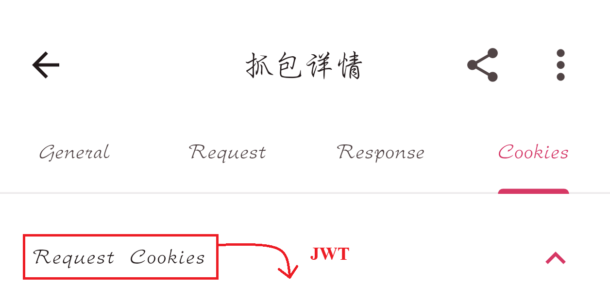

# 抓包获取 JWT 凭证指南（如果遇到什么问题，问AI）

> 本文档说明如何通过 ProxyPin 抓取电费查询系统的登录凭证（JWT），填入 `.env` 后脚本即可自动运行。
>
> **凭证有效期约 30 天**，到期后需按本文档重新抓取一次。脚本会在到期前 3 天邮件提醒你。

---

## 一、准备工作

### 1. 安装 ProxyPin

- **手机端**：在应用商店或 [ProxyPin 官网](https://github.com/wanghongenpin/proxypin) 下载安装


> 图：ProxyPin 主界面，点击「HTTPS 代理」进入证书安装。

---

## 2、安装 HTTPS 证书（必须）

电费查询接口使用 HTTPS，抓包前必须让手机信任 ProxyPin 的 CA 证书，否则只能看到加密乱码。


> 图：ProxyPin「安装根证书」页面。

**操作步骤：**

1. 在 ProxyPin 中点击 **「下载根证书」**
2. 打开手机 **设置 → 安全 → 加密和凭据 → 安装证书 → CA 证书**
3. 选择刚才下载的证书文件并确认安装

> ⚠️ 如果遇到什么问题，问AI。

---

## 二、抓取凭证

### 第 1 步：开始抓包

确保 ProxyPin 正在运行（▶ 按钮变为 ■ 表示正在抓包）。

### 第 2 步：触发请求

在手机上**打开App**，进入「用电缴费」页面。此时 App 会向服务器发送带 JWT 的请求，ProxyPin 会捕获到。

### 第 3 步：定位目标请求

在 ProxyPin 的抓包记录列表中：

1. 点击顶部 **🔍 搜索框**
2. 输入关键字 **`room`**
3. 下方的记录就是我们要找的电费查询接口请求


> 图：搜索 "room" 后筛选出的目标请求（图中 URL 已打码，实际为学校的电费 API 地址）。

### 第 4 步：提取 JWT

点击该条记录进入详情页：

0. 记得查看自己的房间对应的房间号
1. 切换到 **Cookies** 标签页
2. 找到 **Request Cookies** 字段
3. 复制它的**整串值**——这就是 JWT 凭证



> 图：抓包详情页的 Cookies 标签，Request Cookies 即所需的 JWT。

---

## 三、填入程序

运行 `python setup.py`，按照说明填入对应数据

完成！运行 `python dorm_elec_auto.py` 即可。

> ⚡ **续期用**：项目里自带 `update_jwt.py`，专门只更新 JWT、其他配置一律不动：
> ```bash
> python update_jwt.py            # 交互粘贴新 JWT
> python update_jwt.py "eyJ..."   # 直接把新 JWT 当作参数传入
> ```
> 运行后会自动校验新凭证的格式与到期时间，并只改写 `.env` 里的 `XJTU_CEMS_JWT` 一行。**无需重跑 `setup.py`，也无需手动找那一行**。

> 💡 **验证是否成功**：运行脚本后如果没有报「凭证过期/被拒绝」的邮件，且能正常输出余额数据，说明 JWT 已生效。

---

## 四、常见问题

| 问题 | 原因 | 解决方法 |
|------|------|----------|
| 抓到的请求是空的 / 加密乱码 | 未安装或未信任 CA 证书 | 回到第二节重新安装证书 |
| 搜索 "room" 没有结果 | 还没触发 App 请求 | 先在 App 里刷新一下余额页面 |
| 复制出来的值不是以 `eyJ` 开头 | 复制错了字段 | 确认是在 **Cookies 标签 → Request Cookies** 里复制 |
| 填进去后脚本仍报错 | JWT 可能已过期（30 天有效期） | 重新走一遍本流程抓新的 |

---

## 五、有效期与续期

| 项目 | 说明 |
|------|------|
| 有效期 | 固定 **30 天**（从签发时刻起算） |
| 到期前提醒 | 脚本会在到期前 **3 天**自动发邮件提醒（可调 `JWT_WARN_DAYS`） |
| 到期后行为 | 脚本停止监控并发送「凭证已过期」邮件；服务器拒绝时也会立即通知 |
| 续期方式 | 重新抓包后，运行 `python update_jwt.py` 粘贴新 JWT 即可（只改凭证一行，其他配置保留）；也可手动编辑 `.env` 的 `XJTU_CEMS_JWT` 行，代码不用动 |

> 📌 **建议设个日历提醒**：每 25~27 天主动检查一次邮箱有没有收到过期预警，提前抓包更换，避免监控中断。
