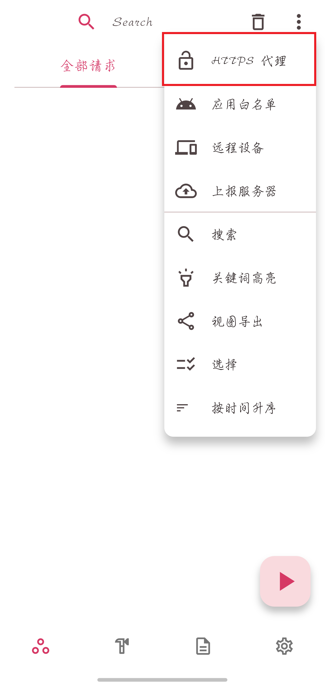
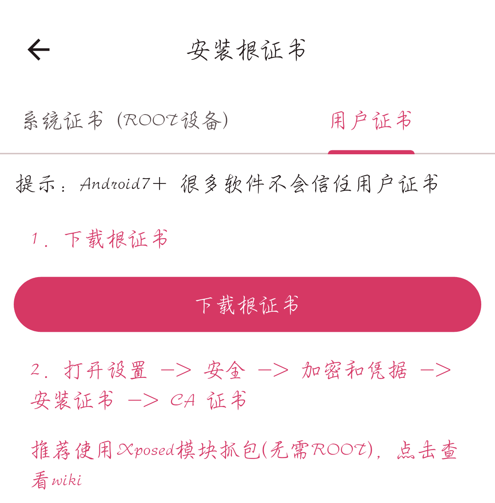
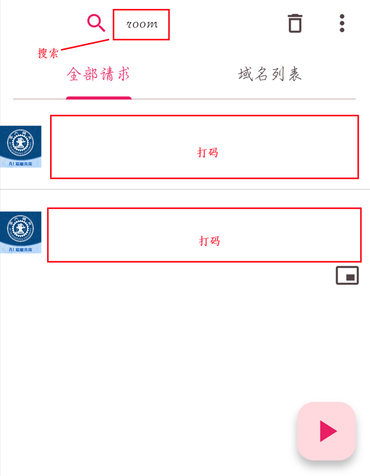
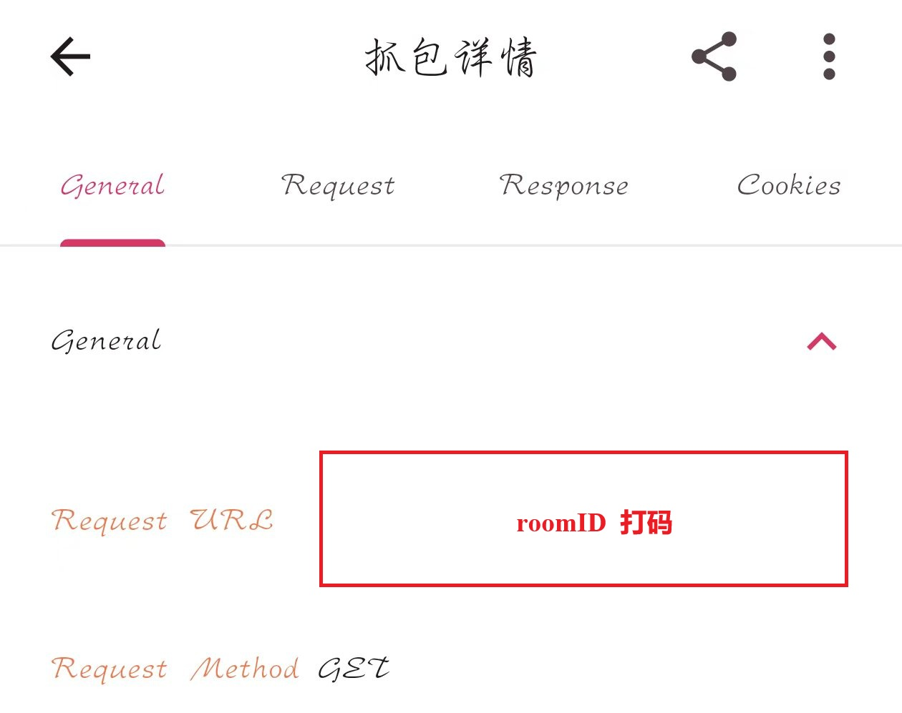

# 抓包获取 roomId 指南（如果遇到什么问题，问 AI）

> 本文档说明如何通过 ProxyPin 抓取电费查询接口的 **`roomId` 参数**。
>
> **好消息：该接口在校园网内仅凭 `roomId` 即可返回余额，不需要任何登录凭证（JWT / Cookie），因此你只需拿到 roomId，无需抓 JWT、也无需续期。**

---

## 一、准备工作

### 1. 安装 ProxyPin

- **手机端**：在应用商店或 [ProxyPin 官网](https://github.com/wanghongenpin/proxypin) 下载安装

> 图：ProxyPin 主界面，点击「HTTPS 代理」进入证书安装。

---

## 2、安装 HTTPS 证书（必须）

电费查询接口使用 HTTPS，抓包前必须让手机信任 ProxyPin 的 CA 证书，否则只能看到加密乱码。

> 图：ProxyPin「安装根证书」页面。

**操作步骤：**

1. 在 ProxyPin 中点击 **「下载根证书」**
2. 打开手机 **设置 → 安全 → 加密和凭据 → 安装证书 → CA 证书**
3. 选择刚才下载的证书文件并确认安装

> ⚠️ 如果遇到什么问题，问 AI。

---

## 二、抓取 roomId

### 第 1 步：开始抓包

确保 ProxyPin 正在运行（▶ 按钮变为 ■ 表示正在抓包）。

### 第 2 步：触发请求

在手机上**打开 App**，进入「用电缴费」页面。此时 App 会向服务器发送电费查询请求，ProxyPin 会捕获到。

### 第 3 步：定位目标请求

在 ProxyPin 的抓包记录列表中：

1. 点击顶部 **🔍 搜索框**
2. 输入关键字 **`room`**
3. 下方的记录就是我们要找的电费查询接口请求

> 图：搜索 "room" 后筛选出的目标请求（图中 URL 已打码，实际为学校的电费 API 地址）。

### 第 4 步：提取 roomId

点击该条记录进入详情页：

1. 切到 **Overview / 请求行** 标签，找到请求 URL，形如：
   `https://ssn.xjtu.edu.cn/cems/mobile/meterAccount/electricity?roomId=2890`
2. URL 中 `roomId=` 后面的数字（如上例的 `2890`）就是你要的 **roomId**

> 图：抓包详情页中请求 URL 里的 `roomId` 参数。

---

## 三、填入程序

运行 `python setup.py`，按提示把 roomId 等信息填好即可（无需填任何凭证）。

完成！运行 `python dorm_elec_auto.py` 即可。

> 💡 **验证是否成功**：脚本在校园网环境下能正常输出余额、不报「接口拒绝访问」，即说明配置正确。

---

## 四、常见问题

| 问题 | 原因 | 解决方法 |
|------|------|----------|
| 抓到的请求是空的 / 加密乱码 | 未安装或未信任 CA 证书 | 回到第二节重新安装证书 |
| 搜索 "room" 没有结果 | 还没触发 App 请求 | 先在 App 里刷新一下余额页面 |
| URL 里找不到 roomId | 点错了请求 / App 用了别的接口 | 确认是 `electricity?roomId=` 这条；也可换关键字 `electricity` 再找 |
| 脚本报「接口拒绝访问」 | 本机不在校园网，或接口地址已变 | 确认处于西安交大校园网（能访问 ssn.xjtu.edu.cn）后再跑 |

---

## 五、说明

- 该 cems 接口**无需登录凭证**：只要本机处于校园网（能访问 `ssn.xjtu.edu.cn` 内网），仅凭 `roomId` 即可取数。
- 因此本项目**没有 JWT、没有 30 天有效期、也不需要续期**。配置里只含 roomId、收件邮箱等，不含任何账号密码。
